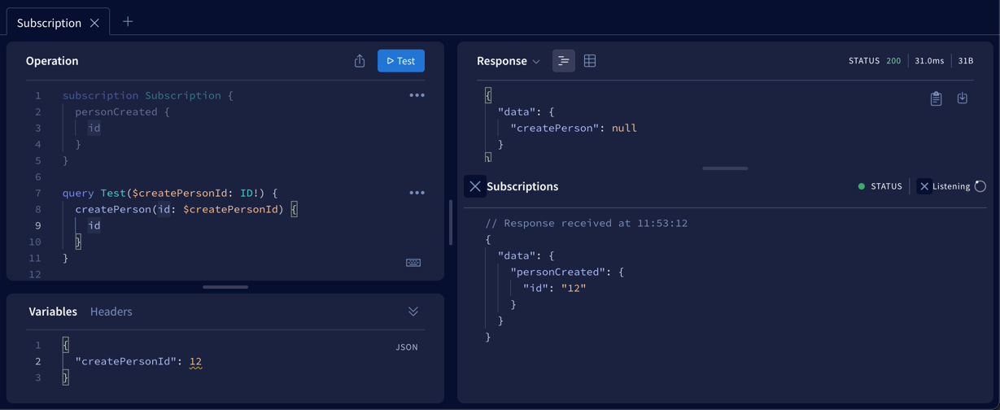

# Mashroom GraphQL Plugin

This plugin adds possibility to define GraphQL service in Mashroom.

It bootstraps Apollo Server using Mashroom internal express application. Subscriptions are supported over Web Sockets.

## Schema stitching

You can have multiple GraphQL Plugins registered on your server.
Schemas from different plugins are stitched together as described here [schema stitching](https://www.graphql-tools.com/docs/schema-stitching/stitch-combining-schemas)

## Example

To start demo server run

   npm i
   npm run dev

and open [localhost:3005/graphql](http://localhost:3005/graphql) in your browser

You can subscribe to change using

```
subscription Subscription {
  personCreated {
    id
  }
}
```

and produce new object running this query

```
query Test($createPersonId: ID!) {
  createPerson(id: $createPersonId) {
    id
  }
}
```

after 1500ms delay you should see activity in subscription window



## Writing GraphQL Plugins for Mashroom Server

Plugin has to have definition like the example bellow
```
{
  "name": "Mashroom GraphQL Echo Plugin",
  "type": "mashroom-graphql-plugin",
  "bootstrap": "./dist/bootstrap.js",
  "defaultConfig": {
    "pubSub": "memory"
  }
}
```

Configuration:

* pubSub - type of pubSub engine: _memory_ or _redis_. _memory_ does not support cluster environment 

Where bootstrap has one default export of the type `MashroomGraphQLPluginBootstrapFunction`

```
const bootstrap: MashroomGraphQLPluginBootstrapFunction = (pluginName, config, contextHolder, pubSub) => {
  return Promise.resolve(new TestGraphQLPlugin(pubSub));
}
```

Bootstrap Parameters:

* pluginName - name of the plugin itself
* config - config provided for the plugin
* contextHolder - holds current context of the plugin
* pubSub - reference to pubSub engine used for subscriptions

Mashroom GraphQL Plugin has to implement following interface

```
interface MashroomGraphQLPlugin {
  getSchema(): DocumentNode | Array<DocumentNode> | string | Array<string>;
  getResolvers(): IResolvers | Array<IResolvers>;
  getPubSub(): PubSubEngine;
}
```

* getSchema - returns schema for current plugin
* getResolvers - resolvers for given schema
* getPubSub - returns reference to current pubSub engine

Example:

```
getSchema(): DocumentNode | Array<DocumentNode> | string | Array<string> {
  return gql`
    type Person {
      id: ID!
    }

    type Query {
      personByName(id: ID!): Person
      createPerson(id: ID!): Person
    }
    
    type Subscription {
      personCreated: Person
    }
  `;
}

getResolvers(): IResolvers | Array<IResolvers> {
    return {
      Query: {
        personByName: (parent, args) => {
          return {
            id: args.id,
          };
        },

        createPerson: (parent, args) => {
          setTimeout(() => {
            this.getPubSub().publish('PERSON_CREATED', {
              personCreated: {
                id: args.id,
              },
            });
          }, 1500);
        },
      },
      Subscription: {
        personCreated: {
          subscribe: () => this.getPubSub().asyncIterator(['PERSON_CREATED']),
        },
      },
    }
  }
```
